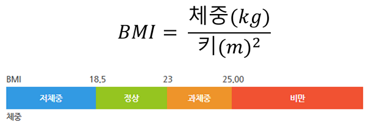

# SHealth BMI (C++)

# Overview
- 삼성 헬스에서는 수집된 데이터를 활용하여 사용자들의 나이대(ex. 20대, 30대, 40대 등)별 저체중/정상체중/과체중/비만의 통계를 계산하고자 합니다.
- 수집 중 누락된 체중값이 있으며 같은 나이대(ex. 20대, 30대, 40대 등)의 평균을 적용합니다. 체중 0이 누락된 경우 입니다.
- 수집 데이터는 ID, 나이, 몸무게(kg), 키(cm)이며, BMI는 체중(kg) / 키(m)제곱 으로 계산합니다.
- BMI 기준으로 18.5이하 저체중, 18.5초과 23미만 정상체중, 23이상 25미만 과체중, 25이상 비만으로 판단합니다.

- 제공된 코드에는 다양한 코드 품질 문제가 있습니다. 


## data sample
- 입력 데이터 (shealth.dat)
```
id,age,weight,height
93705,66,79.5,158.3
93708,66,53.5,150.2
93709,75,88.8,151.1
... (이하 생략)
```
- 각 라인별 ID, 나이, 체중(kg), 키(cm) 순서 입니다.


## 빌드 및 실행

### 요구사항
- CMake 3.10 이상
- C++17 지원 컴파일러
- Google Test (CMake에서 자동 다운로드)

### 빌드
```bash
mkdir build && cd build
cmake ..
cmake --build .
```

### 실행
```bash
./SHealthBMI
```

### 테스트 실행
```bash
cd build
ctest
```


## 프로젝트 구조
```
CMakeLists.txt
shealth.dat
src/
  main/cpp/
    SHealth.h          - SHealth 클래스 헤더
    SHealth.cpp        - BMI 계산 및 통계 로직 구현
    SHealthBMI.cpp     - main 함수 (프로그램 진입점)
  test/cpp/
    SHealthBMITest.cpp - Google Test 기반 단위 테스트
```


# 생성형AI를 활용한 Activities (6 시간)

- [x] **1. 문제 코드 분석 및 코드 스멜 찾기** (1시간)
  - [x] 기본 코드구조, BMI 로직 이해
  - [x] 코드 스멜 찾기
- [x] **2. 1차 리펙토링** (클린코드 관점, 아래 내용을 순차적으로 수행) (1시간)
  - [x] 네이밍 개선
  - [x] 하드코드 및 전역변수 제거
  - [x] 함수 추출
  - [x] 반복/중복 제거
- [x] **3. UnitTest 작성** (1시간)
  - [x] BMI 계산 로직 TC
  - [x] Age 평균치 보정 로직 TC
  - [x] 정상/저체중/과체중/비만 분류 TC
  - [x] 예외상황 TC
- [x] **4. 기능 개선** (2시간)
  - [x] SRP에 따른 책임 분리등 리팩토링
  - [x] 특정 연령대의 BMI 분포 비율 계산 기능 추가
  - [x] Height가 0인 경우에 대한 평균치 보정 로직 추가
  - [x] BMI 정상 범위 사용자 목록 조회 기능 추가
  - [x] 전체 사용자 대비 각 BMI 범주 비율 계산 기능 추가
- [ ] **5. 회고 및 발표** (1시간)
  - [ ] 실습 목표와 달성도
  - [ ] 코드 품질 Before & After
  - [ ] AI를 어떻게 활용했나? 도움이 된 순간과 한계는?
  - [ ] TC를 추가해보면서 개선에 미친 영향, TC 작성 팁
  - [ ] 클린코드와 리팩토링에서 느낀 장점과 어려운점


# 주의 사항
- 코드 품질을 높이기 위해 C++의 경우 STL을 필요한 경우 사용하셔도 됩니다.


---

# `calculateBmi` / `getBmiRatio` 모던 C++ 리팩토링 로드맵

> **관점**: 조건 분기 축소 · 중복 제거 · 타입/정책 분리 · C++17 스타일  
> **근거 문서**: `docs/code_quality_report.md`, `docs/requirements_analysis.md`  
> **대상 코드**: `src/main/cpp/SHealth.h`, `src/main/cpp/SHealth.cpp` (`SHealthBMI.cpp`는 출력만, 동작 변경 최소)

## 제약 (모든 단계 공통)

| 제약 | 의미 |
|------|------|
| **Item 구조체 수정 금지** | 본 프로젝트에 `Item` 타입은 없음. **Phase 0~7** 동안 `ages[]` / `heights[]` / `weights[]` / `bmis[]` + `count` 저장 레이아웃을 유지하고, `HealthRecord`·`Item` 같은 **레코드 구조체 도입·필드 변경은 하지 않음** (Phase 8+에서 별도 결정). |
| **quality 0~50** | 커밋당 **프로덕션 코드 diff 약 50줄 이내**, 한 번에 하나의 스멜만 제거. 거대 리팩터링 금지. |
| **테스트 Green에서만 진행** | 각 커밋 후 `cmake --build` && `ctest` **전부 통과**할 때만 다음 단계. 실패 시 **revert 후** 범위를 줄여 재시도. |

## 검증 명령 (모든 단계 공통)

```bash
cd build
cmake --build .
ctest --output-on-failure
```

최초 1회 (또는 `CMakeLists.txt` 변경 시):

```bash
mkdir -p build && cd build
cmake ..
cmake --build .
ctest --output-on-failure
```

**통과 기준**: `ctest` exit code 0, 실패 테스트 0건.

---

## Phase 0 — 테스트 기반선 (Green 확보) 【필수 선행】

현재 `SHealthBMITest.cpp`의 `FailedTest`는 `FAIL()`로 **항상 Red**입니다. 리팩토링 전에 반드시 Green을 만듭니다.

| # | 작업 | 커밋 메시지 예 |
|---|------|----------------|
| 0.1 | `FAIL()` 테스트 제거 | `test: remove placeholder FAIL test` |
| 0.2 | `TEST_F(SHealthFixture, …)` + `shealth.dat` smoke: `calculateBmi` > 0, `getBmiRatio` 유한값 | `test: add smoke fixture for shealth.dat` |
| 0.3 | (선택) BMI 경계 18.5/23/25 **현행 동작** 스냅샷 1~2건 — 리팩토링 회귀용 | `test: snapshot bmi classification boundaries` |

**체크리스트**

- [ ] `SHealthFixture` 픽스처 (`SetUp`에서 공통 `SHealth` 인스턴스)
- [ ] `ctest` 100% Green
- [ ] `shealth.dat` 경로: 테스트 실행 cwd 기준 (`build/`에서 실행 시 `../shealth.dat` 또는 CMake `WORKING_DIRECTORY` 설정)

**검증**: 위 공통 명령. **Green 아니면 Phase 1 이후 진행 금지.**

---

## Phase 1 — 매직 넘버 상수화 (동작 동일)

**목표**: 분기·로직 변경 없이 리터럴만 `constexpr`로 이름 부여.

| # | 작업 | 파일 | diff 목표 |
|---|------|------|-----------|
| 1.1 | `namespace BmiThreshold { constexpr double kUnderweightMax = 18.5; … }` | `SHealth.h` 또는 `SHealthConstants.h` | ≤30줄 |
| 1.2 | 연령대 `kMinAgeBand=20`, `kMaxAgeBand=70`, `kAgeBandWidth=10` | 동일 | ≤20줄 |
| 1.3 | `kCentimetersPerMeter=100.0`, `kPercentMultiplier=100.0`, CSV 컬럼 인덱스 | 동일 | ≤20줄 |
| 1.4 | `calculateBmi` / `getBmiRatio` 내 리터럴을 상수로 치환 | `SHealth.cpp` | ≤50줄/커밋 |

**체크리스트**

- [ ] `type` 코드 `100/200/300/400` → `constexpr int kTypeUnderweight = 100;` 등 (public API 시그니처 유지)
- [ ] 집계·분류 **결과 수치 변화 없음** (스냅샷 TC 통과)

**검증**: `cmake --build . && ctest` — 기존 TC 전부 Green.

---

## Phase 2 — BMI 분류 정책 단일화 (`classifyBmi`)

**목표**: nested `if` 4분기 → **한 함수 + 테이블(또는 순차 비교)**.

```cpp
// 정책 예시 (README 반열린 구간)
enum class BmiCategory { Underweight, Normal, Overweight, Obesity };

BmiCategory classifyBmi(double bmi) noexcept;
```

| # | 작업 | 패턴 | 커밋 |
|---|------|------|------|
| 2.1 | `classifyBmi` private 구현 + `calculateBmi` 루프에서 호출 | **함수 분해** | `refactor: extract classifyBmi` |
| 2.2 | (TDD) 경계 TC 추가 후 `bmi >= 25` 비만 조건을 README와 정합 | **테이블/단일 함수** | `fix: classify obesity at bmi==25` |

**테이블 기반 예 (C++17)**:

```cpp
struct BmiBand { double upperInclusive; BmiCategory category; };
constexpr std::array<BmiBand, 4> kBmiBands = { ... };
```

**체크리스트**

- [ ] 분류 조건이 `docs/requirements_analysis.md` §1.2와 일치
- [ ] `calculateBmi` 내 BMI 분기 `if` 체인 제거
- [ ] 한 커밋에 경계 수정 + 분류 추출만 (집계 테이블화는 Phase 4)

**검증**: `ctest` + 경계 `TEST_F` 6건 이상 Green.

---

## Phase 3 — 연령대 인덱스·헬퍼 (중복 1차 축소)

**목표**: `a == 20/30/…` 및 `ageClass == 20 && type == 100` 패턴의 **인덱스 산술** 통일.

| # | 작업 | 내용 |
|---|------|------|
| 3.1 | `ageBandIndex(int ageClass) -> int` : `(ageClass - 20) / 10`, 범위 밖 → -1 | |
| 3.2 | `categoryIndex(int type) -> int` : `(type/100) - 1`, 잘못된 type → -1 | |
| 3.3 | `inAgeBand(int age, int bandStart)` : `age >= bandStart && age < bandStart + 10` | |

**체크리스트**

- [ ] `getBmiRatio`는 아직 24분기 가능 — **동작 동일** 유지
- [ ] `calculateBmi` 집계 루프만 헬퍼 사용

**검증**: `ctest` Green; `shealth.dat` 스냅샷 비율 불변.

---

## Phase 4 — 집계 결과 2D 테이블 (24 멤버 → `std::array`)

**목표**: `underweight20`…`obesity70` **24개 필드**를 `std::array<std::array<double,4>,6>` 등으로 통합 (**Item/레코드 구조체 없음**).

| # | 작업 | 커밋 단위 |
|---|------|-----------|
| 4.1 | 헤더: 24 멤버 → `std::array<double, 4> ratiosByBand_[6]` (이름은 프로젝트 컨벤션) | `refactor: replace 24 ratio fields with array` |
| 4.2 | `calculateBmi` 집계: `a==20` 분기 6블록 → `bandIdx` 루프 1블록 | `refactor: dedupe age-band aggregation loop` |
| 4.3 | `getBmiRatio`: 24-way `if` → 인덱스 조회 1줄 + 잘못된 인자 `0.0` | `refactor: table lookup in getBmiRatio` |

**체크리스트**

- [ ] `getBmiRatio(20,100)` 등 **기존 API** 유지
- [ ] 6연령대 × 4카테고리 수치 회귀 TC (Phase 0.3 스냅샷)
- [ ] OCP: 새 연령대는 배열 크기·상수만 변경 (이번 단계에서는 6 밴드 고정)

**검증**: `ctest`; 선택적으로 `SHealthBMI` 실행 출력과 이전 stdout diff (육안 또는 스크립트).

---

## Phase 5 — `calculateBmi` 함수 분해 (SRP, 배열 레이아웃 유지)

**목표**: Long Method 제거. **public** `calculateBmi`는 오케스트레이터만.

| # | private 메서드 (예) | 책임 |
|---|---------------------|------|
| 5.1 | `loadFromCsv(filename)` | 파일 I/O, 헤더 스킵, `count` 채우기 |
| 5.2 | `imputeMissingWeights()` | 연령대별 weight==0 보정 |
| 5.3 | `computeAllBmis()` | BMI 산출 |
| 5.4 | `aggregateRatiosByAgeBand()` | 밴드별 4분류 % → `ratiosByBand_` |

각 서브단계 **별도 커밋** (quality ≤50).

**체크리스트**

- [ ] `calculateBmi` 본문 ~15줄 이하 오케스트레이션
- [ ] `ages/heights/weights/bmis` 배열 미변경
- [ ] `sum==0` / `ageCount==0` 방어는 **별 커밋** (동작 변경 시 TC 선행)

**검증**: `ctest` Green.

---

## Phase 6 — 타입 안전성 (`enum class`) + 조회 정책

**목표**: Primitive Obsession 완화. **외부 API는 int 유지** (호환).

| # | 작업 |
|---|------|
| 6.1 | `enum class AgeBand : int { Twenties = 20, … }`, `enum class BmiCategoryType : int { Underweight = 100, … }` |
| 6.2 | `getBmiRatio` 내부: `static_cast` + 인덱스 조회 |
| 6.3 | (선택) private 오버로드 `getBmiRatio(AgeBand, BmiCategoryType)` |

**전략 패턴 vs 테이블**: 본 도메인은 규칙이 고정 → **테이블 + `classifyBmi`** 가 적합. WHO/아시아 기준 교체가 필요해지면 `IBmiClassifier` + `AsianBmiClassifier` (Phase 6+ 별 프로젝트).

**검증**: `ctest` Green; 잘못된 `ageClass`/`type` TC 유지.

---

## Phase 7 — C++17 스타일 마무리 (동작 동일 우선)

| # | 작업 | 우선순위 |
|---|------|----------|
| 7.1 | `split` 입력 `std::string_view` (호출부만 `string`) | 낮음 |
| 7.2 | 집계 루프 `[[nodiscard]]`, `noexcept` 적절히 | 낮음 |
| 7.3 | `static_cast<double>(count) * kPercentMultiplier / sum` 등 명시 캐스트 정리 | 중간 |

**체크리스트**

- [ ] C++17 미만 문법 도입 금지
- [ ] `SHealthBMI.cpp` 변경 없거나 printf만

**검증**: `ctest` Green.

---

## Phase 8+ (별 Epic, Item/vector 도입 시)

`docs/code_quality_report.md` 우선순위 3~4. **Phase 0~7 완료·Green 유지 후** 착수.

- `std::vector` + `HealthRecord` (이때만 “레코드” 도입 — **Item 구조체 수정 금지** 제약 해제 여부는 팀 합의)
- `sum==0` / 파일 오류 `std::optional` 반환
- Activity 4: height==0 보정, 정상 BMI 목록, 전체 비율 API

---

## 커밋 순서 요약 (권장)

```
Phase0 테스트 Green
  → Phase1 상수화
  → Phase2 classifyBmi
  → Phase3 인덱스 헬퍼
  → Phase4 2D 테이블 + getBmiRatio 조회
  → Phase5 calculateBmi 분해
  → Phase6 enum class
  → Phase7 C++17 polish
```

## 단계별 빠른 체크 (복사용)

| Phase | Green? | build | ctest | 비고 |
|-------|--------|-------|-------|------|
| 0 | ☐ | ☐ | ☐ | FAIL() 제거 필수 |
| 1 | ☐ | ☐ | ☐ | 동작 동일 |
| 2 | ☐ | ☐ | ☐ | 경계 TC |
| 3 | ☐ | ☐ | ☐ | 헬퍼만 |
| 4 | ☐ | ☐ | ☐ | 최대 효과 |
| 5 | ☐ | ☐ | ☐ | SRP |
| 6 | ☐ | ☐ | ☐ | enum |
| 7 | ☐ | ☐ | ☐ | polish |

---

## 참고: 현재 핫스팟

- `calculateBmi`: 파일 로드 → 보정 → BMI → **6연령대×4분기 중복 할당** (~100줄)
- `getBmiRatio`: **24-way** `if-else`
- 잠재 버그: 비만 `bmis[i] > 25` → README는 `≥25` (`docs/requirements_analysis.md` §1.2)

상세 분석: `docs/code_quality_report.md` · 요구사항: `docs/requirements_analysis.md`
