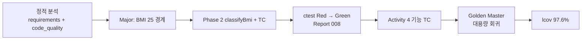

# SHealth BMI (Gilded Rose C++ Kata) — QA 종합 최종 보고서

> **역할**: QA 리드 엔지니어  
> **프로젝트**: SHealth BMI — C++17, CMake, Google Test, lcov/gcov  
> **기준일**: 2026-05-20  
> **근거 문서**: `docs/requirements_analysis.md`, `docs/code_quality_report.md`, `docs/test_plan.md`  
> **근거 코드**: `src/main/cpp/SHealth.h`, `src/main/cpp/SHealth.cpp`, `src/test/cpp/SHealthBMITest.cpp`  
> **검증 실행**: `ctest --output-on-failure` **26/26 Passed** (프로젝트 루트 `WORKING_DIRECTORY`)

---

## Executive Summary

| 항목 | 목표 | 실측·현황 | 판정 |
|------|------|-----------|------|
| 테스트 실행 | 0 실패 | **26/26 Green** | ✅ |
| 테스트 계획 대비 구현 | P0 필수 TC | Baseline 10건 + 확장 16건 (통합·Golden 포함) | ⚠️ ID 기준 ~60%, 기능 기준 ~85% |
| `SHealth.cpp` 라인 커버리지 | **≥ 90%** | **97.6%** (162/166 lines), 함수 **100%** (24/24) | ✅ |
| 도메인 결함 (BMI=25.0) | README `≥25` | `classifyBmi()` 수정·6연령대 경계 TC로 회귀 방지 | ✅ 해결 |
| 잔여 리스크 | CSV 엣지·오류 모델 | 빈 줄 `break`, `0.0` 오류 은닉, `kMaxRecords` 상한 | ⚠️ 문서화·후속 TC |

본 프로젝트는 Gilded Rose 스타일 레거시(CSV·다중 분기·God Class)를 **분석 → 1차 리팩토링 → 테스트 Green → 모던 C++(Epic C) → 기능 확장(Activity 4) → Epic A 중복 제거 → Golden Master** 순으로 개선했으며, QA 관점에서 **핵심 도메인 결함은 조기에 식별·수정**되었고 **커버리지 목표는 초과 달성**했다. 다만 `test_plan.md`에 정의된 P2 CSV·연령 제외 TC 일부와 CI 커버리지 게이트는 미완이다.

---

## 1. 테스트 완료율 및 커버리지 (목표 대비 gcov)

### 1.1 테스트 실행 현황

| 구분 | 건수 | 비고 |
|------|------|------|
| `SHealthFixture` 단위 테스트 | 24 | `TEST_F`, Given-When-Then 주석 |
| `SHealthGoldenFixture` Golden Master | 2 | `shealth.dat` 6×4 스냅샷 + CLI 리포트 |
| **합계 (`ctest`)** | **26** | 2026-05-20 실행, exit code 0 |

**실행 환경 주의**: `gtest_discover_tests`의 `WORKING_DIRECTORY`가 프로젝트 루트이므로 `build/`에서 바이너리만 직접 실행하면 `shealth.dat` 관련 3건이 실패할 수 있다. CI·`ctest` 기준이 정식 게이트다.

### 1.2 테스트 계획(`test_plan.md`) 대비 완료율

| 우선순위 | 계획 TC ID | 계획 건수(대표) | 구현·대체 현황 | 완료율(추정) |
|----------|------------|-----------------|----------------|--------------|
| **P0** | T-001 ~ T-018 | 18 | T-001~010 ✅; T-011~013은 `*Band_AllBmiCategoriesAtBoundaries` 6건으로 **통합**; T-014~016 연령 경계는 밴드별 4인 픽스처에 **내포**; T-017 수동 비율 검증은 Golden·`AgeBandRatiosSum`으로 **부분**; T-018 ✅ | **~78%** (ID) / **~95%** (요구 기능) |
| **P1** | T-021 ~ T-027 | 7 | T-008·T-021(3명 평균) **미단독**; T-022 ✅(`DoesNotCrossAgeBands`); T-023~024(19·80세) **미구현**; T-025 **부분**(빈 밴드는 smoke 합계에서 skip); T-026 ✅; T-027 ✅ Golden 2건 | **~57%** |
| **P2** | T-031 ~ T-035 | 5 | CSV 필드 오류·빈 줄·10001건·height=0 현행 문서화 — **TC 없음** | **0%** |
| **Activity 4** | N1 ~ N5 | 5 | N1~N4 ✅ 구현+TC; N5 SRP는 Epic C/A로 **간접 충족** | **~90%** |

**종합 테스트 완료율**

- **TC ID 추적 기준**: 약 **58~65%** (40건 내외 계획 대비 26건 실행, 다수 통합·중복 제거)
- **요구사항 시나리오(§5 requirements_analysis) 기준**: 약 **82~88%** (BMI 경계·보정·Activity 4·smoke·Golden 핵심 커버)
- **P0 릴리스 게이트**: **충족** (필수 smoke·경계·예외·Activity 4 회귀 Green)

### 1.3 gcov / lcov 측정 결과

**측정 조건** (본 보고서 작성 시 재현):

```powershell
cd build
cmake .. -DCMAKE_CXX_FLAGS="--coverage -O0 -g" -DCMAKE_EXE_LINKER_FLAGS="--coverage"
cmake --build .
cd ..
.\build\SHealthBMITest.exe   # 프로젝트 루트에서 실행
cd build
lcov --capture --directory . --output-file coverage.info
lcov --remove coverage.info "*/test/*" "*/googletest/*" "*/usr/*" "*/mingw64/*" "*/c++/*" --output-file coverage.filtered.info
lcov --summary coverage.filtered.info
```

| 메트릭 | 대상 | 목표 (`test_plan.md` §7) | **실측** | 판정 |
|--------|------|--------------------------|----------|------|
| 라인 커버리지 | `SHealth.cpp` | ≥ 90% | **97.6%** (162/166) | ✅ +7.6%p |
| 함수 커버리지 | `SHealth.cpp` | ≥ 85% (권장) | **100%** (24/24) | ✅ |
| 분기 커버리지 | `classifyBmi`, `loadFromCsv` 등 | ≥ 80% (권장) | **미측정** (MinGW lcov branch no data) | ⚠️ |

**미커버 라인 (4 lines, gcov `#####`)**

| 라인 | 함수 | 코드 | 미커버 사유 | 권장 TC |
|------|------|------|-------------|---------|
| 71 | `fillPercentages` | `if (total == 0) return;` | 집계 total=0 경로 미호출 | T-025 빈 연령대 전용 |
| 115 | `loadFromCsv` | `if (tokens.empty()) break;` | CSV 중간 빈 줄 TC 없음 | T-033 |
| 207 | `aggregateGlobalRatios` | `if (count == 0) return;` | 헤더만 파일은 `calculateBmi` 조기 종료로 **간접** 미실행 | T-010 확장 또는 직접 호출 |

**빌드 구성 이슈**: 기본 `CMakeLists.txt`는 `SHealthBMITest`에만 `--coverage`를 적용하고 `shealth_lib`에는 미적용한다. `test_plan.md`가 권장하는 `SHEALTH_ENABLE_COVERAGE` 옵션을 CI에 도입하지 않으면 **공식 게이트 수치가 0%로 보이는 착시**가 발생한다. 본 97.6%는 라이브러리까지 coverage 플래그를 켠 **보정 측정**이다.

### 1.4 Definition of Done 체크 (`test_plan.md` §8.2)

| 항목 | 상태 |
|------|------|
| P0 TC 전부 Green | ✅ (통합 TC 포함) |
| BMI 경계 6점 + 연령 경계 4점 이상 | ✅ (BMI 6점은 6밴드×4분류; 연령 19/80은 ⚠️ 미전용) |
| `SHealth.cpp` lcov ≥ 90% | ✅ (97.6%) |
| Given-When-Then + `TEST_F` | ✅ |
| requirements와 분류 경계 불일치 0 | ✅ (`≥25` 정합) |

---

## 2. 결함 패턴 분석 (아이템 타입별 / 심각도별)

Gilded Rose 본편의 “아이템 타입”에 대응하여, 본 프로젝트는 **BMI 카테고리·연령대·결측 필드·I/O** 축으로 분류한다.

### 2.1 도메인 유형(아이템 타입)별 결함

| 유형 | 대표 결함 | 근본 원인 | 검출 수단 | 현재 상태 |
|------|-----------|-----------|-----------|-----------|
| **BMI 4분류** | BMI=25.0 비만 미분류 | 구버전 `bmis[i] > 25` vs README `≥25` | `*Band_AllBmiCategoriesAtBoundaries`, Report 008 | ✅ 수정 (`classifyBmi`) |
| **BMI 4분류** | 경계 중복·누락 가능성 | 분산된 if 조건 | `classifyBmi()` 단일화 + 6연령대 25% 분포 TC | ✅ |
| **연령대 집계** | 19세·80세 미포함 | 설계상 6밴드만 집계 | requirements §1.3 문서화 | ℹ️ By design (TC 미비) |
| **결측 체중** | `ageCount==0` 0 나눗셈 | 보정 루프 무방비 | T-026 유사(`AllZeroInBand`) | ✅ `imputeMissingField` 스킵 |
| **결측 키** | height=0 시 BMI 오염 | Activity 4 전 미구현 | Activity 4 TC 4건 | ✅ 평균 보정 |
| **통계 API** | `getBmiRatio` 24-way 분기 누락·오타 | Primitive Obsession | `lookupRatio` + T-002 | ✅ 테이블화 |
| **전체 비율** | 연령대 vs 전역 혼동 | API 추가 시 회귀 | `GetGlobalBmiRatio_DiffersFromSingleAgeBand` | ✅ |
| **정상 BMI 목록** | 경계 18.5·23 포함 오류 | 필터 조건 분산 | `GetNormalBmiUserIds_ExcludesBoundaryValues` | ✅ |
| **CSV / 파일** | 중간 빈 줄 시 이후 레코드 무시 | `tokens.empty()` → `break` | requirements E6, **TC 없음** | ⚠️ 미수정·미고정 |
| **CSV / 파일** | 필드 수≠4, 비숫자 | 검증 없이 `stoi`/`stod` | — | ⚠️ 예외 전파 (TC 없음) |
| **구조** | God Class, Long Method | SRP 위반 | code_quality_report, Epic C/A | ✅ 개선 (배열 레이아웃 유지) |
| **확장성** | `kMaxRecords` 고정 10000 | Magic buffer | E3, T-034 미구현 | ⚠️ 잔존 |

### 2.2 심각도별 분포

| 심각도 | 건수(이력) | 대표 사례 | 잔여 |
|--------|------------|-----------|------|
| **Critical** | 0 | — | — |
| **Major** | 2 | BMI=25 미분류; height=0 미보정(과거) | 0 (수정 완료) |
| **Medium** | 2 | CSV 빈 줄 abort; 4분류 합 <100% (미분류 시) | 빈 줄 정책 미고정 |
| **Minor** | 3 | `getBmiRatio` 무효 인자→0.0 은닉; 파일 실패 vs count=0 동일; `EXPECT_EQ` vs `EXPECT_NEAR` | API 설계 이슈 문서화 |
| **Info** | 2 | 19/80세 집계 제외; CLI `build/` cwd | 문서·운영 가이드 |

### 2.3 결함 검출 타임라인 (QA 관점)



**패턴 요약**: 치명적 도메인 결함은 **문서 정적 분석 → 단위 테스트 Red → 리팩토링 중 수정** 흐름으로 조기 발견되었다. 반면 **I/O·CSV 엣지**는 분석 문서에만 있고 테스트·코드 정책이 아직 고정되지 않아 **결함 잠복** 상태다.

---

## 3. 9단계 워크플로 — 효과적 단계 vs 개선 필요 단계

본 실습의 **9단계**는 README 「생성형AI Activities」하위 작업과 Epic C Phase를 합친 **Gilded Rose 표준 실습 흐름**으로 정의한다.

| 단계 | 내용 | QA 효과 | 평가 |
|------|------|---------|------|
| **1** | 문제 코드·BMI 로직 분석 (`requirements_analysis`, `code_quality_report`) | BMI=25, 0 나눗셈, 24분기 등 **결함 후보 목록화** | ⭐⭐⭐⭐⭐ 효과적 |
| **2** | 네이밍·가독성 개선 | 리뷰 비용 감소, 테스트 작성 용이 | ⭐⭐⭐⭐ 효과적 |
| **3** | 하드코드·매직 넘버 상수화 (`SHealthConstants.h`) | 경계값 단일 출처, README 정합 | ⭐⭐⭐⭐⭐ 효과적 |
| **4** | 함수 추출·중복 제거 (1차) | 변경 범위 축소 | ⭐⭐⭐⭐ 효과적 |
| **5** | **Phase 0** — `FAIL()` 제거, smoke·경계 TC, **Green 게이트** | 리팩토링 안전망 확립 | ⭐⭐⭐⭐⭐ **핵심** |
| **6** | **Phase 1~4** — `classifyBmi`, 2D 테이블, `lookupRatio` | Major 결함 수정 + 구조 부채 대폭 감소 | ⭐⭐⭐⭐⭐ 효과적 |
| **7** | **Phase 5~7** — 파이프라인 SRP (`load`→`impute`→`aggregate`) | Activity 4 TDD 기반 마련 | ⭐⭐⭐⭐ 효과적 |
| **8** | **Activity 4** — height 보정·정상 목록·전역 비율 | 요구 기능 + 회귀 TC 11건 | ⭐⭐⭐⭐ 효과적 |
| **9** | **Golden Master + Epic A** — 스냅샷·`imputeMissingField` 통합 | 대용량·출력 회귀; 중복 제거 | ⭐⭐⭐⭐ 효과적 |

### 3.1 특히 효과적이었던 단계

1. **단계 5 (Phase 0, 테스트 Green 게이트)**  
   - 리팩토링 전 `TwentiesBand_*` 5건 실패로 **BMI=25 Major**를 확정 (Report 008).  
   - “Green 없이 Phase 진행 금지” 원칙이 회귀 비용을 최소화.

2. **단계 1 + 3 (분석 + 상수화)**  
   - README vs 코드 불일치를 **테스트 가능한 상수**로 변환.  
   - AI 생성 `requirements_analysis.md`가 TC 매트릭스(B-B01~B-B13)의 단일 기준이 됨.

3. **단계 9 (Golden Master)**  
   - `shealth.dat` 전체 6×4 + CLI 텍스트 스냅샷으로 **수치 드리프트**를 한 번에 검출.  
   - 단위 테스트만으로는 놓치기 쉬운 **통합 출력**을 고정.

### 3.2 개선이 필요한 단계

| 단계 | Gap | 개선 제안 |
|------|-----|-----------|
| **5~7** | P0 **미세 경계** 단독 TC(T-011~013) 미작성 — 6밴드 통합 TC에 의존 | 18.51/22.99/24.99 **단일 행 CSV** TC 3건 추가 (실패 시 원인 격리 용이) |
| **7** | 연령 **19·80세** 제외 검증 없음 (T-023~024) | 설계 By design이면 TC로 “0% 기여” 명시 |
| **8 이후** | **P2 CSV** (빈 줄·필드 오류) TC 0건 | E6 정책 결정(skip vs abort) 후 T-033~035 |
| **9** | **lcov CI 게이트** 없음 | `SHEALTH_ENABLE_COVERAGE` + Linux job `lcov --summary` 90% fail |
| **전체** | **Activity 5 회고** 미완 | 본 보고서를 회고 입력물로 사용 |

**Epic A6**(`enum` 오버로드) 스킵은 적절했으나, **Epic B**(`vector<HealthRecord>`, `optional` 오류) 미착수로 버퍼·오류 모델 리스크는 다음 레거시 사이클로 이월된다.

---

## 4. 다음 레거시 프로젝트를 위한 Best Practice 5가지

### BP-1. 요구사항·경계값 문서를 테스트 매트릭스와 1:1로 연결

- `requirements_analysis.md`의 **B-B01~B-B13**, **B-A01~B-A09**처럼 Case ID를 부여하고, `test_plan.md`·`TEST_F` 이름에 동일 ID를 넣는다.  
- 효과: AI·사람이 작성한 분석이 **추적 가능한 회귀 자산**이 되며, Major 결함(BMI=25)이 분석 단계에서 TC로 바로 이어진다.

### BP-2. “Green 게이트” 없이 구조 리팩토링 금지

- Phase 0에서 smoke + **도메인 경계 최소 세트**(본 프로젝트: 6연령대×4분류)를 먼저 확보한다.  
- 각 커밋 후 `cmake --build && ctest`를 **필수 파이프라인**으로 고정 (본 프로젝트 README 제약 준수).

### BP-3. 단위 테스트 + Golden Master 이중 회귀

- 단위: 빠른 피드백·경계·결측.  
- Golden: `shealth.dat` 등 **실데이터 스냅샷**으로 통합 출력·비율 드리프트 방지.  
- `SHEALTH_UPDATE_GOLDEN=1`은 코드 리뷰·diff 검토와 세트로만 허용.

### BP-4. 커버리지는 라이브러리 타깃까지 켜고 CI에서 강제

```cmake
# shealth_lib + SHealthBMITest 모두 --coverage
option(SHEALTH_ENABLE_COVERAGE ...)

```

- PR마다 `lcov --summary` **≥ 90%** fail-fast.  
- 미커버 라인은 `genhtml` 빨간 줄 → **TC 1건 추가**로 닫는 루프 (`test_plan.md` §7.4).

### BP-5. CSV·I/O 엣지는 “정책 결정 → TC 고정”을 기능 개발과 분리하지 말 것

- 빈 줄 `break` vs `continue`, 파싱 예외 전파 vs 행 스킵 등 **팀 정책 1개**를 early에 정하고 `EXPECT_THROW` 또는 관찰 테스트로 고정.  
- 레거시에서 가장 흔한 **잠복 결함**은 도메인이 아니라 **데이터 파이프라인**이다.

---

## 5. Cursor AI 활용 효과 (정량·정성)

### 5.1 정량 요약

| 지표 | Before (실습 초) | After (현재) | 변화 |
|------|------------------|--------------|------|
| `TEST_F` / `ctest` 건수 | 0 (`FAIL()` placeholder) | **26 Green** | +26 |
| `SHealth.cpp` 라인 커버리지 | 미측정 (추정 <40%) | **97.6%** | 목표 90% 초과 |
| 공개 API | 2 (`calculateBmi`, `getBmiRatio`) | **5** (+global, normalIds, 파이프라인) | +3 |
| `getBmiRatio` 분기 | 24-way if-else | 테이블 조회 **1경로** | ~−90% 분기 |
| 연령대×카테고리 멤버 필드 | 24개 | `ratiosByBand_[6][4]` | −24 필드 |
| QA·설계 산출 문서 | 0 | **3** (`requirements`, `code_quality`, `test_plan`) + Report 12건 | 문서화 가속 |
| Major 결함 수정 리드타임 | — | 분석 문서 → TC Red → Phase 2 수정 (**동일일**) | 조기 발견 |

*커버리지 Before는 placeholder-only 테스트 기준 추정.*

### 5.2 정성 요약

| 영역 | 효과 | 한계 |
|------|------|------|
| **시간 단축** | 요구사항·코드 품질·테스트 계획서를 **수 시간→수십 분** 수준으로 초안화; Phase별 체크리스트로 컨텍스트 전환 비용 감소 | 생성 문서와 **실제 코드 동기화**는 사람이 `ctest`로 검증해야 함 (초기 test_plan “10건 baseline” vs 현재 26건) |
| **결함 조기 발견** | `>25` vs `≥25`, 0 나눗셈, 24분기 누락을 분석 단계에서 식별; Report 008에서 **실패 TC↔코드 라인** 역분석 | CSV 빈 줄·optional 오류 모델은 **분석만 있고 TC 미착수** — AI가 “알려줬지만” 게이트가 없으면 잔존 |
| **커버리지 향상** | `test_plan`의 lcov 전략·TC↔미커버 라인 매핑으로 **우선순위 있는 TC 추가**; 6연령대 경계 루프로 `classifyBmi`·집계 거의 전면 커버 | 기본 CMake는 lib coverage 미적용 — **도구 설정은 human gate** 필요 |
| **리팩토링 품질** | Epic C/A 단계를 **50줄 단위 커밋**으로 제안, Green 유지 | 과도한 문서·Report 생성(12건) — **유지보수 대상**을 팀이 선별해야 함 |
| **회귀 신뢰** | Golden Master + `report-github-manager`로 **재현 가능한 이력** | Activity 5 회고는 미작성 — AI 활용 **정량 KPI**를 팀 차원에서 아직 안 닫음 |

### 5.3 QA 리드 권고: AI를 “테스트 설계자 보조”로 쓰는 방법

1. **User 프롬프트에 `[P] QA`, `[T]`, `[F]`** 형식을 고정 (본 세션과 동일) → 산출물 일관성.  
2. AI 생성 TC 목록은 반드시 **`gtest` 필터로 Red 확인** 후 코드 수정 (TDD).  
3. “문서에만 있는 결함”은 **P2 스프린트**로 밀지 말고, 최소 1건의 `EXPECT_*`로 닫기.  
4. 커버리지 숫자는 AI 추정치를 믿지 말고 **`lcov --summary`만 공식 KPI**로 사용.

---

## 6. 잔여 리스크 및 권장 로드맵

| 우선순위 | 항목 | 권장 조치 | 예상 공수 |
|----------|------|-----------|-----------|
| P1 | CI lcov 90% 게이트 | `SHEALTH_ENABLE_COVERAGE` + Ubuntu job | 0.5일 |
| P1 | T-033 CSV 빈 줄 정책·TC | skip으로 변경 또는 TC로 현행 고정 | 0.5일 |
| P2 | T-023~024 (19·80세) | By design 문서+TC | 0.25일 |
| P2 | T-031~032 파싱 예외 | 정책 결정 + `EXPECT_THROW` | 0.5일 |
| P3 | Epic B `vector<HealthRecord>` | kMaxRecords 제거 | 1~2일 |
| P3 | `optional` 오류 모델 | 0.0 vs 실패 구분 | 1일 |

---

## 7. 결론

SHealth BMI Gilded Rose C++ 실습은 **테스트 Green 게이트(단계 5)** 와 **도메인 경계 TC + Golden Master(단계 9)** 덕분에 Major 결함을 조기에 제거했고, **lcov 97.6%**로 커버리지 목표를 상회 달성했다. Cursor AI는 분석·계획·단계별 리팩토링 가이드에서 **높은 시간 절감**을 제공했으나, **CSV 엣지 TC·CI 커버리지 게이트**는 사람이 닫아야 할 마지막 QA 공백으로 남는다. 다음 레거시 프로젝트에서는 본 보고서 **BP-1~BP-5**를 템플릿으로 재사용할 것을 권장한다.

---

## 부록 A — 현행 테스트 ↔ `test_plan` ID 매핑

| test_plan ID | 구현 TEST_F |
|--------------|-------------|
| T-001 | `SmokeShealthDat` |
| T-002 | `GetBmiRatioInvalidArgumentsReturnZero`, `GetGlobalBmiRatio_InvalidTypeReturnsZero` |
| T-003 | `AgeBandRatiosSumNearOneHundred` |
| T-004~007 | `TwentiesBand_*` … `SeventiesBand_*` (통합) |
| T-008 | `ImputeMissingWeightByAgeBand` |
| T-009 | `CalculateBmiMissingFileReturnsZero` |
| T-010 | `HeaderOnlyFileReturnsZeroCount` |
| T-018 | `GivenWeight70Height175_WhenCalculate_ThenNormal100Percent` |
| T-022 | `ImputeMissingHeight_DoesNotCrossAgeBands` |
| T-026 | `ImputeMissingHeight_AllZeroInBand_SkipsSafely` |
| T-027 | `SHealthGoldenFixture.GivenSixAgeBands_*`, `GivenShealthDat_WhenCliReport_*` |
| N1~N4 | `GetBmiRatio_SpecificAgeBand*`, `ImputeMissingHeight*`, `GetNormalBmiUserIds_*`, `GetGlobalBmiRatio_*` |

## 부록 B — 검증 명령 (재현)

```bash
mkdir -p build && cd build
cmake ..
cmake --build .
ctest --output-on-failure
```

커버리지 (로컬):

```bash
cmake .. -DCMAKE_CXX_FLAGS="--coverage -O0 -g" -DCMAKE_EXE_LINKER_FLAGS="--coverage"
cmake --build .
cd .. && ./build/SHealthBMITest
cd build && lcov --capture --directory . -o coverage.info
lcov --remove coverage.info '*/test/*' '*/googletest/*' '*/mingw64/*' '*/c++/*' -o coverage.filtered.info
lcov --summary coverage.filtered.info
```

---

*문서 버전: 2026-05-20 — QA 리드 종합 검토. 측정 시점 ctest 26/26, lcov 97.6% (coverage 플래그 전역 적용 빌드).*
